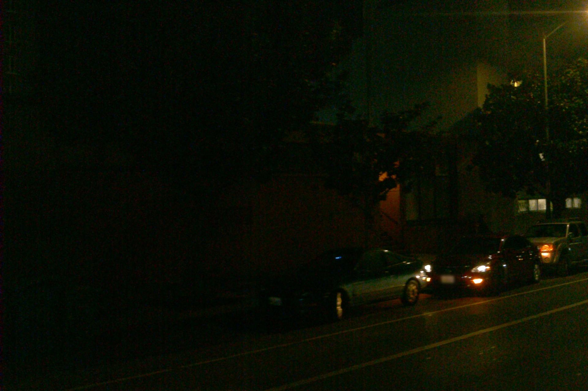
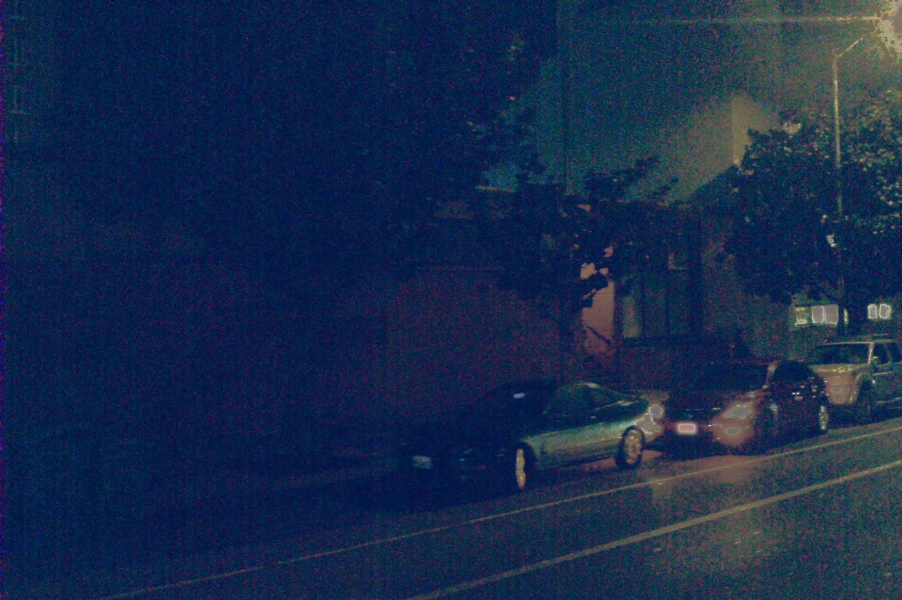

# Nighttime low illumination image enhancement using Dark/Bright channel priors

- This is the implementation of nighttime low illumination image enhancement using dark/bright channel priors.
- This project is developed based on [1] & [2] for optimal processing speed.
- Paper: [Nighttime low illumination image enhancement with single image using bright/dark channel prior](https://jivp-eurasipjournals.springeropen.com/articles/10.1186/s13640-018-0251-4)

## 0. Dependencies
- Python 3x
- OpenCV
- Numpy
- Matplotlib

## 1. Usage
1. Set name or path of image in [bcp-dcp.py](https://github.com/tranleanh/nighttime-image-enhancement/blob/7dbd3a5c40d2fa259b22ab51b94ecc42c7eb11a6/bcp-dcp.py#L138)
2. Simply run:
```bashrc
$ python bcp-dcp.py
```

## 2. Result

- Input:



- Output:



### Acknowledgement
This repo is developed based on below projects:

[1] [Python-image-enhancement-with-bright-dark-prior](https://github.com/ba-san/Python-image-enhancement-with-bright-dark-prior)

[2] [Single Image Haze Removal Using Dark Channel Prior](https://github.com/He-Zhang/image_dehaze)


LA Tran

Nov. 2021
